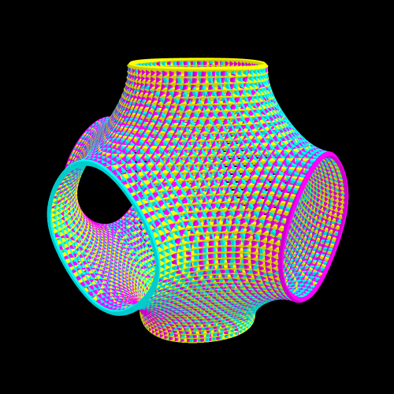

## Description of TPMS in General
TPMS is short for Triply Periodic Minimal Surfaces
There are several types like

- SchwarzP
- Diamond
- Gyroid

=== "Schwarz P"

    This is the Schwarz P surface.

=== "Diamond"

    This is the Diamond surface.

=== "Gyroid"

    This is the Gyroid surface.

You can take a [Pause](break.md) before you continue reading.

The Gyroid surface can be described by:

\[
\sin(x)\cos(y) + \sin(y)\cos(z) + \sin(z)\cos(x) = 0
\]

The first examples of TPMS were the surfaces described by Schwarz in 1865, followed by a surface described by his student E. R. Neovius in 1883.

*Example of a schwarzP TPMS.*